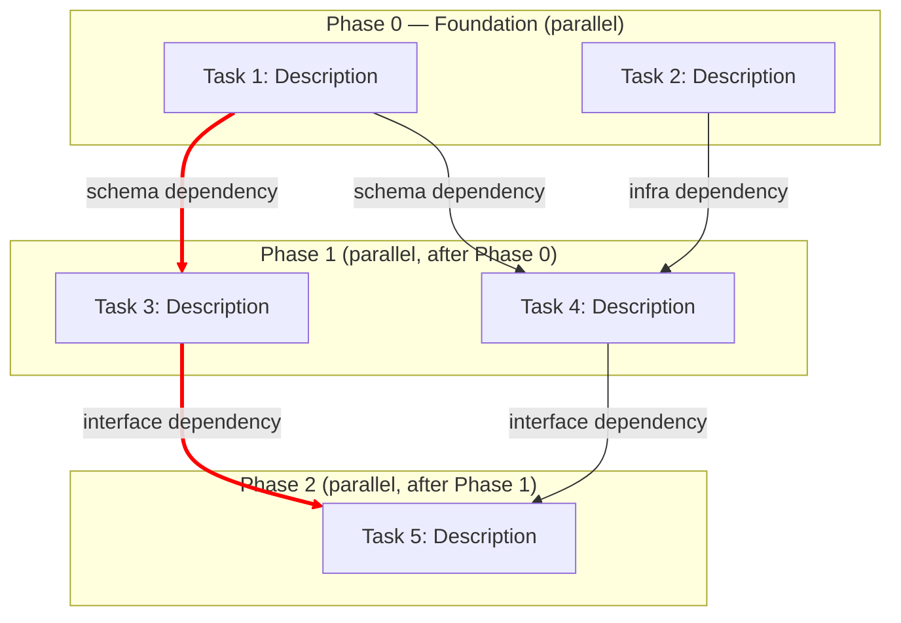

# Task Dependency Analyzer

You help engineers decompose technical plans into a dependency-aware execution graph. The goal
is to figure out which tasks are truly independent (and can therefore run in parallel — by
humans or agents) and which have real dependencies that force sequential execution.

## Why this matters

In agentic workflows (multiple AI agents or developers working simultaneously), the difference
between good and bad task decomposition is enormous. If you incorrectly mark two tasks as
independent when one actually needs the other's output, you get merge conflicts, wasted work,
or broken builds. If you incorrectly mark two tasks as dependent when they could run in
parallel, you waste time waiting unnecessarily.

The key insight from practitioners like Stripe's Minions team and Adolfo Builes' Agents Kanban:
the sweet spot is **plan well, then let independent tasks fly in parallel while dependent tasks
queue up automatically**. This skill is the "plan well" part.

## How to analyze dependencies

### Step 1: Extract tasks from the input

The user will provide a technical plan, feature spec, list of tasks, or similar document.
Parse it and extract each discrete unit of work. A "task" is something one person or agent
could complete independently — it has a clear start and end, produces a concrete artifact
(code, config, doc), and can be verified.

If the input is vague or high-level, help the user decompose it further before analyzing
dependencies. A good task is specific enough that you can reason about its inputs and outputs.

### Step 2: Identify the dependency types

For each pair of tasks, check for these dependency patterns (from most common to least):

**Data/Schema dependencies** — Task B needs a data structure, API, or schema that Task A
creates. This is the most common and most important type. Example: "Create user model" must
come before "Build user registration endpoint" because the endpoint needs the model to exist.

**Interface/Contract dependencies** — Task B calls a function, API, or service that Task A
implements. Even if B could stub it out, the real integration needs A's output. Example:
"Implement payment gateway client" before "Build checkout flow."

**Infrastructure dependencies** — Task B needs infrastructure (database, queue, deployment
config) that Task A provisions. Example: "Set up PostgreSQL schema" before "Write migration
scripts."

**Logical/Semantic dependencies** — Task B doesn't directly consume Task A's code, but the
design decisions in A constrain B. Example: "Design authentication strategy (JWT vs sessions)"
before "Implement auth middleware" — because the middleware implementation depends on which
strategy was chosen.

### Step 3: Check for false dependencies

This is where most people get it wrong. Just because two tasks touch the same area doesn't
mean they depend on each other. Check for these false-dependency patterns:

**Shared file, different sections** — Two tasks both modify the same file but in different,
non-overlapping sections. These are independent (merge conflicts are resolvable, not blocking).
Example: Adding two different API endpoints to a router file.

**Same domain, different features** — Two tasks are both "user-related" but don't actually
share code paths. Example: "Add user avatar upload" and "Add user email preferences" — both
touch the user module but are functionally independent.

**Read-only sharing** — Task B reads something that Task A also reads (but neither writes).
No dependency.

**Convention/Pattern dependencies** — "Task B should follow the same pattern as Task A."
This is NOT a real dependency — it's a preference. Both can be done independently and
reconciled later.

### Step 4: Build the dependency graph

Organize tasks into execution phases:

- **Phase 0 (Foundation)**: Tasks with zero dependencies — these can all start immediately
  and run in parallel.
- **Phase 1**: Tasks that depend only on Phase 0 tasks — these start as soon as their
  specific upstream tasks complete.
- **Phase N**: Tasks that depend on Phase N-1 or earlier tasks.

Within each phase, all tasks are independent of each other and can run in parallel.

### Step 5: Identify the critical path

The critical path is the longest chain of dependent tasks from start to finish. This
determines the minimum total time for the project. Highlight it in the output — it tells
the user where to focus optimization efforts (break up tasks on the critical path, or
find ways to remove dependencies).

## Output format

Produce a **Mermaid flowchart** that shows:

1. Tasks grouped by execution phase (using subgraphs)
2. Dependency arrows between tasks with labels explaining the dependency type
3. The critical path highlighted with thick/colored edges
4. A summary table below the diagram

Use this Mermaid structure:



After the Mermaid diagram, include a structured summary:

```
## Dependency Analysis Summary

**Total tasks**: N
**Execution phases**: M
**Maximum parallelism**: P tasks (in Phase X)
**Critical path**: Task A → Task C → Task F (estimated ~X units)
**Independent tasks** (no dependencies): Task 1, Task 2, ...

### Dependency Rationale
| Upstream | Downstream | Type | Reason |
|----------|------------|------|--------|
| Task 1   | Task 3     | Schema | Task 3 needs the User model that Task 1 creates |
| ...      | ...        | ...    | ... |

### Potential false dependencies to reconsider
- Task X and Task Y both touch file Z but in different sections — could potentially run in parallel
- ...
```

## Important considerations

**Be conservative with dependencies.** When in doubt about whether a dependency exists, ask
yourself: "If an agent started Task B right now with no knowledge of Task A's output, would
it produce something broken or incompatible?" If the answer is "it might have to redo some
work but the result would be valid," that's not a real dependency — it's a preference for
efficiency.

**Consider the agent context.** In agentic workflows, each task typically gets its own branch
and sandbox. This means file-level conflicts are resolved at merge time, not at dev time.
So "both tasks edit the same file" is usually NOT a dependency.

**Surface uncertainty.** If you're not sure about a dependency, say so. Include a "potential
false dependencies" section where you flag things the user should validate.

**Think about the review step.** In the Agents Kanban pattern, tasks go through human review
before merging. A downstream task starts when its upstream reaches "review ready" — not
"merged." This means the downstream agent can start working on a branch based on the
upstream's PR head, even before it's merged. Keep this in mind when reasoning about
dependency strictness.

## Integration with Agents Kanban Local

After producing the Mermaid diagram and analysis, also generate a JSON payload that can be
POSTed directly to `/api/tasks/bulk` to create all tasks with their dependencies in the
local kanban board. Use this format:

```json
{
  "tasks": [
    {
      "taskId": "kebab-case-id",
      "title": "Human readable title",
      "prompt": "Full prompt/instructions for the agent to execute this task",
      "phase": 0,
      "repoUrl": ".",
      "tags": [],
      "autoStart": true,
      "dependencies": []
    },
    {
      "taskId": "downstream-task",
      "title": "Task that depends on another",
      "prompt": "Instructions...",
      "phase": 1,
      "repoUrl": ".",
      "tags": [],
      "autoStart": true,
      "dependencies": [
        { "upstreamTaskId": "kebab-case-id", "primary": true }
      ]
    }
  ]
}
```

Rules for generating this payload:
- `taskId` should be a short kebab-case identifier (e.g., "setup-db", "add-auth-middleware")
- `prompt` should be a complete, self-contained instruction that an agent (Claude Code) can
  execute without additional context. Include the specific files to create/modify, the patterns
  to follow, and acceptance criteria.
- `phase` must match the execution phase from the dependency analysis
- Set `primary: true` on the dependency whose branch should be the source for this task's
  worktree. If there's only one dependency, mark it as primary. If there are multiple, pick
  the one whose code changes are most relevant to this task.
- `autoStart: true` means the sentinel will automatically run this task when its dependencies
  are satisfied. Set to `false` for tasks that need human review before starting.

This JSON output enables a one-command workflow:
```bash
curl -X POST http://localhost:3456/api/tasks/bulk \
  -H "Content-Type: application/json" \
  -d @tasks.json
```

The sentinel will then automatically orchestrate execution: Phase 0 tasks start immediately
in parallel, and downstream tasks start as soon as their upstreams reach review-ready state.
